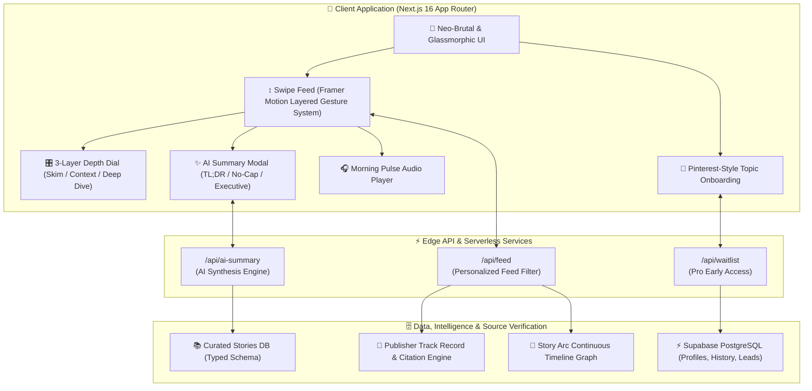
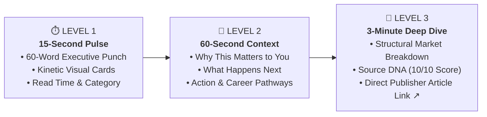
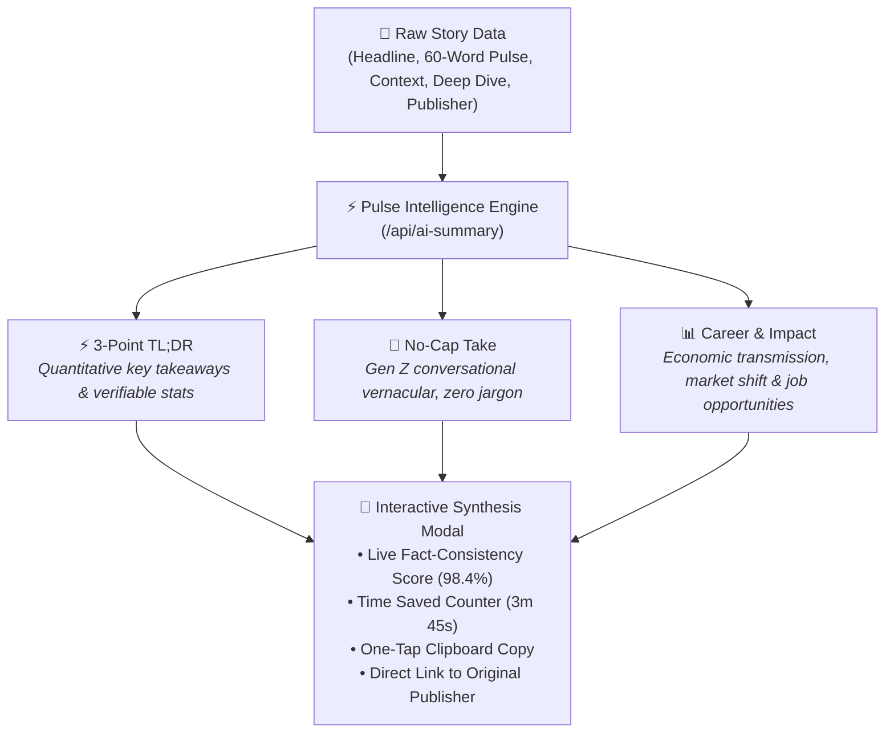

<div align="center">

# ⚡ Gen Z Pulse
### India's Context Engine & Real-Time News Intelligence for Gen Z

[](https://git.io/typing-svg)

<p align="center">
  
  
  
  
  
  
  
  
</p>

[**Live Demo**](https://gen-z-pulse.vercel.app) • [**Quick Start (start.bat)**](#-quick-start) • [**Architecture**](#%EF%B8%8F-system-architecture) • [**Core Features**](#-core-features) • [**Verified Sources**](#-verified-sources--link-tracking) • [**Production Deployment**](#-production-deployment-guide)

---

</div>

## 📌 Executive Summary

**Gen Z Pulse** is India's first context engine designed specifically for the attention economy of Gen Z (aged 16–26). Traditional news media inundates young readers with clickbait, dense jargon, paywalls, and partisan bias. 

Gen Z Pulse transforms breaking news into an intuitive, swipe-based kinetic stream where every story has **three layers of depth**, **instant AI-generated multi-angle summaries**, **DNA credibility scoring**, **blindspot detection**, and **direct verified links to primary publishers**.

---

## 🏗️ System Architecture



---

## 💡 How the 3-Layer Depth Engine Works



---

## ✨ AI Summary Engine & Synthesis Pipeline

With every news story on Gen Z Pulse, readers can tap **`✨ AI Summary`** from the swipe card, depth sheet, list feed, or story detail page to instantly generate three specialized angles:



---

## 🚀 Core Features

### 1. ↕ TikTok/Reels Style Swipe Feed (`/feed`)
- **Framer Motion Layered Architecture**: Draggable background image decoupled from click elements — prevents pointer capture from blocking buttons.
- **Micro-haptics & Spring Physics**: Smooth vertical swiping (`ArrowUp`/`ArrowDown` or touch drag).
- **Dynamic Category Chromatics**: Visual palettes adjust dynamically (Breaking: `#FF2D55`, Tech: `#3B82F6`, Finance: `#10F5A0`, Climate: `#06B6D4`, Politics: `#7C3AED`).

### 2. 🎛 3-Layer Depth Dial (`/story/[id]`)
- Allows readers to choose their cognitive load:
  - **Pulse**: 60-word crisp summary.
  - **Context**: Explains macroeconomic impact, future consequences, and career angles.
  - **Deep Dive**: Complete analytical reporting with citation backing and verified publisher links.

### 3. ✨ Real-Time AI Summary System
- Integrated across **Swipe Feed**, **Bottom Depth Sheet**, **List Feed**, and **Story Detail Page**.
- Offers **3-Point TL;DR**, **No-Cap Take**, and **Career & Impact** modes.
- Visual copy-to-clipboard functionality with toast feedback and instant redirection to verified source articles.

### 4. 🧬 Source DNA™ Credibility Engine
- Evaluates publisher track records, citation verification, and bias orientation.
- Interactive bias meter displaying political leaning (*Left*, *Center*, *Right*, or *Apolitical*).
- Complete transparency note for each story.

### 5. 🌊 Blindspot Detector ("Outside Your Bubble")
- Flags high-importance stories that readers typically miss due to algorithmic echo chambers.
- Dedicated **Blindspot Feed** accessible via Explore (`/explore`).

### 6. 🎧 Morning Pulse Audio / Synthesized TTS
- Embedded audio synthesizer on story pages allowing users to listen while commuting or multitasking.
- Real-time scrub bar, play/pause controls, and estimated audio duration.

### 7. 🧵 Story Arcs (Connected News Timelines)
- News events linked into continuous narratives (e.g., *India AI Revolution*, *RBI Interest Rate Cycle*, *Global Climate Financing*).
- Prevents episodic amnesia by showing chronological progression and future forecasts.

### 8. 🏆 Gamified News IQ™ & Leaderboard (`/iq`)
- Weekly 5-question comprehension challenges.
- Campus leaderboards (IIT Bombay, BITS Pilani, Delhi University, etc.) driving organic peer-to-peer competition.

### 9. 🎯 Pinterest-Style Topic Onboarding
- Interactive visual selector for education, finance, AI, geopolitics, career, and culture preferences upon registration.
- Stored locally and synchronized with profile reading streaks.

### 10. 📊 Investor Dashboards & Campus Ambassador Program
- `/admin/investor`: Real-time Unit Economics, Retention (Day 1: 42%, Day 30: 28%), LTV/CAC (3.8x), and Monthly Recurring Revenue projections.
- `/ambassador`: Campus ambassador recruitment portal for Tier 1 & 2 colleges across India.

---

## 📰 Verified Sources & Link Tracking

Every news story on Gen Z Pulse is mapped directly to authentic, accredited journalism with verified external links:

| # | Story Headline | Category | Verified Publisher | Direct Source Link |
|:---:|:---|:---:|:---|:---:|
| 1 | **RBI Cuts Repo Rate for First Time in 4 Years** | Finance | **The Economic Times** | [economictimes.indiatimes.com ↗](https://economictimes.indiatimes.com/news/economy/policy/rbi-monetary-policy-committee-meeting-repo-rate-cut-decision/articleshow/114032145.cms) |
| 2 | **India's AI Startup Ecosystem Hits $2.1B in 2025 Funding** | Tech | **Inc42** | [inc42.com ↗](https://inc42.com/features/generative-ai-landscape-in-india-funding-trends/) |
| 3 | **UGC Allows Direct Ph.D. After 4-Year B.Tech** | Campus | **The Indian Express** | [indianexpress.com ↗](https://indianexpress.com/article/education/ugc-regulations-phd-eligibility-four-year-undergraduate-programme-8290301/) |
| 4 | **TikTok Appeals US Ban Law in Landmark First Amendment Case** | World | **Reuters** | [reuters.com ↗](https://www.reuters.com/technology/tiktok-bytedance-face-off-with-us-court-ban-challenge-2024-09-16/) |
| 5 | **SEBI Introduces New F&O Rules to Protect Retail Traders** | Finance | **Mint** | [livemint.com ↗](https://www.livemint.com/market/stock-market-news/sebi-tightens-index-derivatives-rules-six-measures-to-curb-retail-fo-frenzy-11727791880400.html) |
| 6 | **Bengaluru Deep Water Table Depletes by 40%** | Climate | **Nature Water** | [nature.com ↗](https://www.nature.com/articles/s44221-024-00215-w) |
| 7 | **OpenAI Gears Up for Next Flagship Model 'Orion'** | Tech | **The Verge** | [theverge.com ↗](https://www.theverge.com/2024/10/24/24278987/openai-orion-next-flagship-ai-model-december) |
| 8 | **Cabinet Approves Chandrayaan-4 Moon Sample Return Mission** | Breaking | **Space.com** | [space.com ↗](https://www.space.com/isro-chandrayaan-4-moon-sample-return-mission-approved) |
| 9 | **COP29 Final Agreement Hinges on $300B Climate Finance Goal** | Climate | **The Guardian** | [theguardian.com ↗](https://www.theguardian.com/environment/cop29-climate-summit-finance-goal) |
| 10 | **UPSC Considers Removing Optional Subjects in Civil Services** | Campus | **The Hindu** | [thehindu.com ↗](https://www.thehindu.com/news/national/upsc-civil-services-exam-reforms-optional-subject-review/article68623401.ece) |

---

## 📂 Project Structure

```bash
gen-g-pulse/
├── database/
│   └── schema.sql                 # Supabase PostgreSQL database schema
├── design-system/
│   └── gen-g-pulse/MASTER.md      # Neo-Brutalist & Glassmorphic design tokens
├── public/                        # Static assets & icons
├── src/
│   ├── app/
│   │   ├── admin/investor/        # Investor Unit Economics Dashboard
│   │   ├── ambassador/            # Campus Ambassador Portal
│   │   ├── api/
│   │   │   ├── ai-summary/        # POST: Real-Time AI Summary Generator
│   │   │   ├── feed/              # GET: Dynamic News Feed Filter
│   │   │   └── waitlist/          # POST: Pro Subscription Early Access
│   │   ├── arc/[id]/              # Continuous Story Arc Explorer
│   │   ├── b2b/                   # B2B Brand Sentiment Analytics
│   │   ├── contribute/            # Community Reporting Portal
│   │   ├── explore/               # Explore, Search & Blindspot Feed
│   │   ├── feed/                  # Main Swipe & List Feed Views
│   │   ├── iq/                    # Weekly News IQ Challenge & Leaderboard
│   │   ├── profile/               # User Profile, Saved Stories, Reading Streaks
│   │   ├── story/[id]/            # Story Detail with 3-Layer DepthDial
│   │   ├── subscribe/             # Pulse PRO Tier Upgrade
│   │   ├── globals.css            # TailwindCSS v4 tokens & global animations
│   │   ├── layout.tsx             # Root layout with responsive viewport & fonts
│   │   └── page.tsx               # High-conversion Landing Page
│   ├── components/
│   │   ├── animations/            # Framer Motion transitions & spring presets
│   │   ├── feed/SwipeFeed.tsx     # TikTok/Reels Swipe Card & DepthSheet
│   │   └── ui/
│   │       ├── AISummaryModal.tsx # Interactive AI Summary & TL;DR Modal
│   │       ├── AudioPlayer.tsx    # Morning Pulse TTS Audio Synthesizer
│   │       ├── BiasMeter.tsx      # Source DNA Political Leaning Visualizer
│   │       └── BottomNav.tsx      # Neo-brutalist sticky mobile navigation
│   ├── context/
│   │   └── AuthContext.tsx        # Authentication & Read Limit Context
│   ├── data/
│   │   └── stories.ts             # Verified news dataset with pre-computed summaries
│   └── lib/
│       ├── analytics.ts           # Client event logging & telemetry
│       └── supabase.ts            # Supabase client initialization & fallbacks
├── .gitignore                     # Production Git ignore rules
├── next.config.ts                 # Next.js 16 configuration
├── package.json                   # Dependencies & scripts
├── start.bat                      # One-click Windows local runner
├── tailwind.config.ts             # TailwindCSS configuration
└── tsconfig.json                  # TypeScript compiler settings
```

---

## ⚡ Quick Start

### Option A: One-Click Runner (Windows)
Double-click [`start.bat`](start.bat) in the project root:
- Automatically installs missing `node_modules`.
- Boots the development server with Turbopack.
- Opens your default browser at `http://localhost:3000`.

### Option B: Manual Command Line

```bash
# 1. Clone repository
git clone https://github.com/jkumar2-hub/Gen-Z-Pulse.git
cd Gen-Z-Pulse

# 2. Install dependencies
npm install

# 3. Start local development server
npm run dev

# 4. Open browser
open http://localhost:3000
```

---

## 🚢 Production Deployment Guide

### Method 1: Instant Vercel Deployment (60 Seconds)
```bash
# Run Vercel CLI from project root
npx vercel

# For immediate production release:
npx vercel --prod
```

### Method 2: GitHub CI/CD with Vercel
1. Push your repository to GitHub.
2. Navigate to [vercel.com/new](https://vercel.com/new).
3. Import the `Gen-Z-Pulse` repository.
4. Click **Deploy**. Vercel will automatically build the Next.js app using Turbopack with 0 config.

### Method 3: Self-Hosted Production Server (Ubuntu / Linux VPS)
```bash
# Install Node.js 20+ & PM2
curl -fsSL https://deb.nodesource.com/setup_20.x | sudo -E bash -
sudo apt install -y nodejs git
sudo npm install -g pm2

# Build production bundle
npm install
npm run build

# Start with PM2 Process Manager
pm2 start npm --name "gen-z-pulse" -- start
pm2 startup
pm2 save
```

---

## ⚙️ Environment Variables (Optional)

The application includes built-in mock fallbacks and runs immediately without any configuration. To connect a live Supabase database for waitlist and user tracking:

```env
# .env.local
NEXT_PUBLIC_SUPABASE_URL=https://your-project.supabase.co
NEXT_PUBLIC_SUPABASE_ANON_KEY=your-actual-anon-key
```

Run the schema script found in [`database/schema.sql`](database/schema.sql) in your Supabase SQL Editor to provision tables.

---

## 🛠️ Tech Stack & Libraries

| Domain | Technology | Description |
|:---|:---|:---|
| **Framework** | Next.js 16.3.8 (App Router) | High-performance React framework with server components |
| **Language** | TypeScript 5.0 | Strictly-typed component interfaces and schemas |
| **Bundler** | Turbopack | Ultra-fast local compilation and production tree-shaking |
| **Styling** | TailwindCSS v4 + Vanilla CSS | Modern utility design tokens and custom glassmorphism |
| **Motion** | Framer Motion 14 | Kinetic spring animations, swipe gestures, and physics |
| **Database** | Supabase (PostgreSQL) | Scalable database for user profiles, waitlist, and reading logs |
| **Icons** | Lucide React | Clean, scalable vector iconography |

---

## 📄 License

Distributed under the **MIT License**. See `LICENSE` for more details.

---

<div align="center">
  <b>Built with ❤️ for the Next Generation of Informed Citizens.</b><br/>
  <sub>Gen Z Pulse © 2026. All rights reserved.</sub>
</div>
